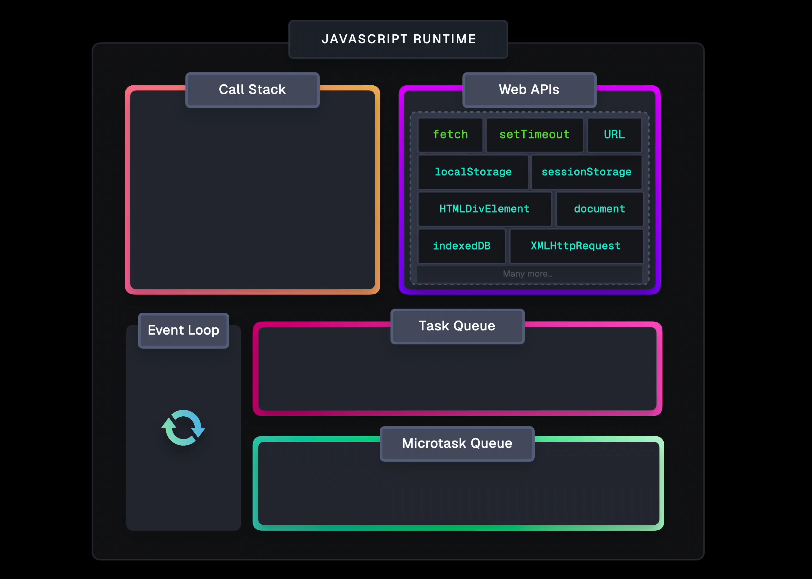

# How Does Async JavaScript Work?

JavaScript runs in a **single-threaded** environment, which means it can only do **one thing at a time**. To handle tasks like fetching data, waiting for timers, or responding to user actions without freezing the page, JavaScript uses the **event loop** — a coordination system between the **call stack**, **Web APIs**, and **task queues**.

---

## Key Concepts

- **Call Stack:** Holds synchronous function calls. Functions are added ("pushed") when called and removed ("popped") when finished.

- **Web APIs (Browser APIs):** The browser provides features like `setTimeout`, `fetch`, DOM events, etc., that run outside the main thread (JavaScript runner - Call Stack).

- **Task Queue (Macrotasks):** When a Web API finishes, its callback is placed in this queue. The event loop checks if the call stack is empty before pushing the next task.  
  **Examples:**  
  - `setTimeout`, `setInterval`  
  - UI events (`click`, `scroll`)  
  - Network responses

- **Microtask Queue:** A separate queue with **higher priority** than the task queue. It's processed **immediately after the current task**, before the next one begins.  
  **Examples:**  
  - Promise callbacks (`.then()`, `.catch()`, `.finally()`)  
  - `queueMicrotask()`  
  - `MutationObserver`

- **Render Queue:** Used by the browser to manage visual updates like DOM changes and CSS recalculations. It’s triggered after microtasks, before the next task.

- **Event Loop:** Continuously monitors the call stack. When it's empty, the event loop:
  1. Runs all **microtasks** (if any)
  2. Handles one **macrotask** (from the task queue)
  3. Triggers rendering (if needed)
  4. Repeats the cycle

---

## Why It Matters

- **Blocking the main thread** with heavy synchronous code causes UI freezes.
- Use **asynchronous tools** to let long-running tasks happen outside the stack.
- Always remember: **Microtasks > Macrotasks**, so Promises run before `setTimeout`.

---

## Practical Tips

- Use **debouncing**, **throttling**, and **web workers** to avoid unnecessary work in the main thread.
- Keep functions short and responsive.
- Understand async flow to debug better and write smoother UIs.

---

## Visual Tools

- [Loupe](http://latentflip.com/loupe/) – Event loop visualizer  
- [JS Visualizer 9000](https://www.jsv9000.app/) – Call stack/task queue animation

---

## Learn More

- [JavaScript Visualized: Event Loop, Web APIs, (Micro)task Queue – Lydia Hallie](https://www.lydiahallie.com/blog/event-loop)  
- [Tasks, Microtasks, Queues and Schedules – Jake Archibald](https://jakearchibald.com/2015/tasks-microtasks-queues-and-schedules/#what-are-some-browsers-doing-differently)  
- [JavaScript Execution Model – MDN](https://developer.mozilla.org/en-US/docs/Web/JavaScript/Reference/Execution_model)
